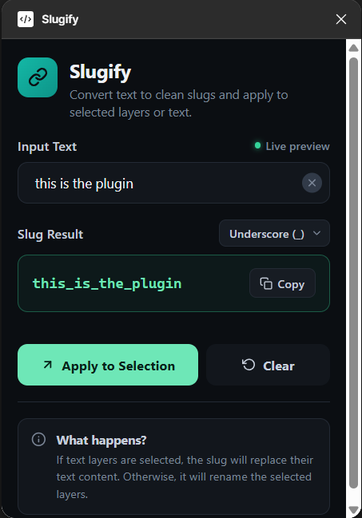

# Slugify

Slugify is a Figma plugin that converts text into a clean, lowercase slug and applies it to the current selection. Selected text layers have their content replaced with the slug. Any other selected layers are renamed to it.



## Features

- Converts text to a slug as you type, with a live preview.
- Three separators: underscore (`_`), hyphen (`-`) and dot (`.`).
- Replaces the content of selected text layers, including layers that use several fonts.
- Renames selected frames, groups, components, shapes and other layers when no text layer is selected.
- Copies the slug to the clipboard for use outside Figma.

## Installation

The plugin is loaded as a development plugin from this repository.

1. Open the Figma desktop app.
2. Go to **Plugins > Development > Import plugin from manifest**.
3. Select `Slugify/manifest.json`.
4. Run it from **Plugins > Development > Slugify**.

There is no build step. `code.js` and `ui.html` are loaded by Figma as they are.

## Usage

1. Type or paste text into **Input Text**. The slug appears under **Slug Result** as you type.
2. Choose a separator from the menu next to **Slug Result**. The result updates immediately.
3. Select one or more layers on the canvas.
4. Click **Apply to Selection**, or click **Copy** to copy the slug to the clipboard.

**Clear** empties the input and the result. **Apply to Selection** stays disabled until the result contains at least one character.

A status message below the result confirms how many layers were changed, or explains why nothing was applied.

## Slug Rules

The input is converted in this order:

1. Convert to lowercase.
2. Remove leading and trailing whitespace.
3. Remove every character that is not `a-z`, `0-9`, a space, `_` or `-`.
4. Replace each run of spaces, underscores and hyphens with a single separator.

Examples with the default underscore separator:

| Input                    | Slug                  |
| ------------------------ | --------------------- |
| `Primary Button`         | `primary_button`      |
| `Hero -- Title (Large)`  | `hero_title_large`    |
| `  Sign   up_now  `      | `sign_up_now`         |
| `Version 2.0`            | `version_20`          |
| `Café Menu`              | `caf_menu`            |
| `-draft-`                | `_draft_`             |

Notes:

- Accented and non-Latin characters are removed, not transliterated.
- Dots in the input are removed, even when the dot separator is selected.
- A leading or trailing hyphen or underscore in the input becomes a leading or trailing separator.

## Apply Behavior

What **Apply to Selection** does depends on the layers selected:

| Selection                              | Result |
| -------------------------------------- | ------ |
| Nothing selected                       | No change. The plugin asks you to select a layer. |
| One or more text layers                | The text content of each selected text layer is replaced with the slug. |
| Text layers mixed with other layers    | Only the text layers are changed. The other layers are left as they are. |
| No text layers                         | Every selected layer is renamed to the slug. |

Additional details:

- Only layers that are selected directly are affected. Text layers inside a selected frame or group are not changed. The frame or group itself is renamed instead.
- Before replacing text, the plugin loads every font used in the layer. When a layer has mixed fonts, Figma applies the formatting of the first character to the new text.
- When several layers are renamed, the status message lists the layer types that were affected, for example `[FRAME, COMPONENT]`.

## Project Structure

```
Slugify/
  manifest.json   Plugin manifest
  code.js         Main thread: slug conversion, font loading, text replacement and renaming
  ui.html         Plugin UI: markup, styles and scripts in one file
```

### Message Protocol

The UI and the main thread communicate through `postMessage`.

| Direction  | Type       | Purpose |
| ---------- | ---------- | ------- |
| UI to main | `slugify`  | Convert `text` to a slug using `separator`. Sent on every input and separator change. |
| UI to main | `apply`    | Apply `slug` to the current selection. |
| UI to main | `cancel`   | Close the plugin. |
| Main to UI | `result`   | The converted slug. |
| Main to UI | `success`  | Number of layers changed. |
| Main to UI | `error`    | No selection, or a font could not be loaded. |

Slug conversion runs in the main thread, so the preview and the applied value always use the same rules.

## Limitations

- Only lowercase ASCII letters and digits are kept. Text in other scripts produces an empty or partial slug.
- The separator cannot be customized beyond the three options in the menu.
- Every font used by a selected text layer must be available in Figma. If a font is missing, the plugin reports an error. Text layers whose fonts did load may already have been updated.
- The input and the chosen separator are not saved between sessions.
