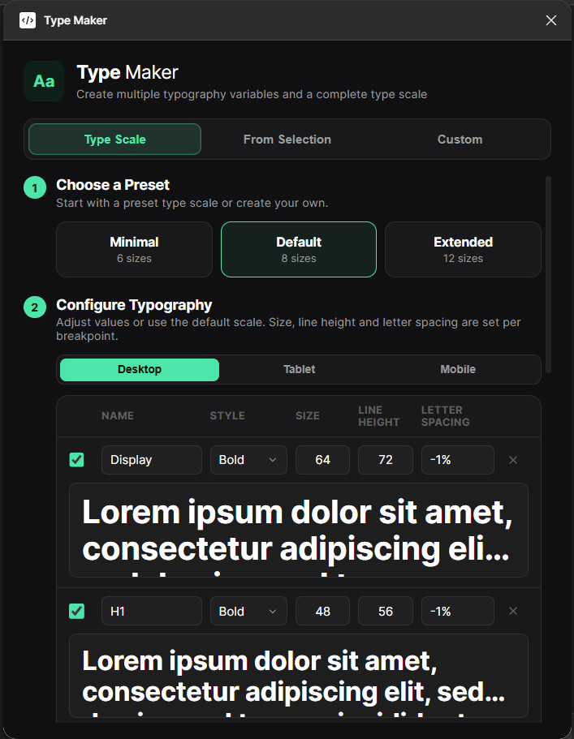

# Type Maker

Type Maker is a Figma plugin that generates a responsive typography system as local text styles. It builds a complete type scale from a preset, from values you define, or from text layers already on the canvas, and writes one text style per breakpoint (Desktop, Tablet, Mobile).



## Features

- Three ways to build a scale: presets, a custom table, or detection from selected text layers.
- Size, line height and letter spacing are set per breakpoint for every style.
- Styles are grouped by breakpoint in Figma's style picker (for example, `Desktop/H1`, `Mobile/H1`).
- Running the plugin again updates existing styles with the same name instead of creating duplicates.
- A searchable font family picker lists every font available in the current Figma session.
- Each row has a live preview and can be switched off without deleting it.

## Installation

The plugin is loaded as a development plugin from this repository.

1. Open the Figma desktop app.
2. Go to **Plugins > Development > Import plugin from manifest**.
3. Select `TypeMacker/manifest.json`.
4. Run it from **Plugins > Development > Type Maker**.

There is no build step. `code.js` and `ui.html` are loaded by Figma as they are.

## Usage

The plugin has three tabs. Each ends with a **Create Text Styles** button that writes the styles to the current file.

### Type Scale

Start from a predefined scale and adjust it.

1. Choose a preset: **Minimal** (6 sizes), **Default** (8 sizes) or **Extended** (12 sizes).
2. Edit names, font styles and values in the table. Use the Desktop, Tablet and Mobile tabs above the table to set values for each breakpoint.
3. Choose the font family.
4. Select the breakpoints to generate.

Selecting a different preset replaces the rows currently in the table.

### From Selection

Build a scale from the typography already used in a design.

1. Select one or more text layers, or frames that contain them, on the canvas.
2. The plugin reads font size, line height, letter spacing, font family and font style from each text layer. The table updates when the selection changes.
3. Review the detected rows. They are sorted from largest to smallest and named `Display`, `H1`, `H2` and so on. Rename them as needed.
4. Select the breakpoints to generate.

Each detected row keeps the font family of the layer it came from. The tab has no font family picker.

### Custom

Build a scale from an empty table. Add a row for each size you need, set its values for each breakpoint, choose a font family and select breakpoints.

## Presets

All values are in pixels except letter spacing, which is a percentage of the font size. A preset starts with the same values on all three breakpoints.

| Style         | Minimal       | Default       | Extended      | Font style |
| ------------- | ------------- | ------------- | ------------- | ---------- |
| Display Large | -             | -             | 72 / 80       | Bold       |
| Display       | 56 / 64       | 64 / 72       | 64 / 72       | Bold       |
| H1            | 40 / 48       | 48 / 56       | 48 / 56       | Bold       |
| H2            | 28 / 36       | 32 / 40       | 32 / 40       | Semibold   |
| H3            | -             | 24 / 32       | 24 / 32       | Semibold   |
| H4            | -             | 20 / 28       | 20 / 28       | Medium     |
| H5            | -             | -             | 18 / 26       | Medium     |
| Body Large    | 16 / 24       | 16 / 24       | 16 / 24       | Regular    |
| Body          | 14 / 20       | 14 / 20       | 14 / 20       | Regular    |
| Body Small    | -             | -             | 13 / 18       | Regular    |
| Caption       | 12 / 16       | 12 / 16       | 12 / 16       | Regular    |
| Overline      | -             | -             | 11 / 14       | Medium     |

Values are shown as font size / line height.

## Field Reference

| Field          | Description |
| -------------- | ----------- |
| Name           | The style name. The breakpoint is added in front of it, so `H1` becomes `Desktop/H1`. |
| Style          | The font style, such as `Regular` or `Bold`. It must exist in the selected font family. |
| Size           | Font size in pixels. |
| Line Height    | Line height in pixels. |
| Letter Spacing | A percentage such as `-0.5%`, or a plain number for pixels such as `0.2`. The Up and Down arrow keys change it by 0.1. |
| Checkbox       | Unchecked rows are skipped. |

A breakpoint with a size of 0 is skipped for that row.

## Output

For each enabled row and each selected breakpoint, the plugin creates or updates one local text style:

```
Desktop/Display
Desktop/H1
...
Tablet/Display
Tablet/H1
...
Mobile/Display
Mobile/H1
...
```

Styles are matched by their full name. If a style named `Desktop/H1` already exists, its font, size, line height and letter spacing are overwritten and its other properties stay the same.

## Project Structure

```
TypeMacker/
  manifest.json   Plugin manifest
  code.js         Main thread: font loading, selection scanning, text style creation
  ui.html         Plugin UI: markup, styles and scripts in one file
```

### Message Protocol

The UI and the main thread communicate through `postMessage`.

| Direction   | Type                       | Purpose |
| ----------- | -------------------------- | ------- |
| UI to main  | `get-fonts`                | Request the list of available font families and their styles. |
| UI to main  | `get-selection-typography` | Request typography data for the current selection. |
| UI to main  | `generate`                 | Create or update text styles from `rows` and `options`. |
| UI to main  | `close`                    | Close the plugin. |
| Main to UI  | `fonts-list`               | Available font families and their styles. |
| Main to UI  | `selection-typography`     | Detected rows and the font families used in the selection. Also sent whenever the selection changes. |
| Main to UI  | `generate-complete`        | Number of styles created or updated. |
| Main to UI  | `generate-error`           | Error message when generation fails. |

## Limitations

- The font family and every font style used in the table must be installed or available in Figma. If one is missing, generation stops with an error.
- From Selection detects one row per unique font size. Text layers of the same size with a different font or line height are merged into the first one found.
- Text layers with mixed formatting inside a single layer are skipped.
- Line height set to Auto or to a percentage is converted to 1.4 times the font size.
- Styles are only created or updated. The plugin never deletes existing styles.
