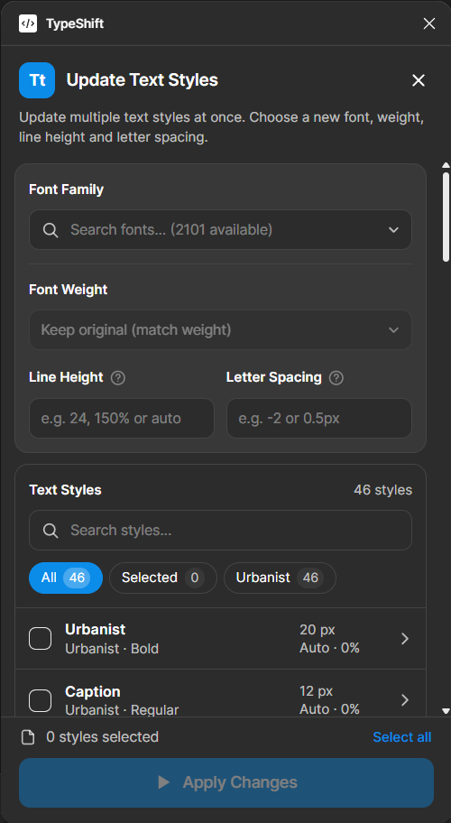

# TypeShift

TypeShift is a Figma plugin that changes the font family, line height and letter spacing of local text styles. Choose the values to change, tick the text styles to update, and every selected style gets the new values. When the font changes, each style keeps its weight where the new font has it, and falls back to the closest weight where it does not.

## Features

- Lists every local text style in the file with its current font, weight, size, line height and letter spacing.
- Searchable list of every font available in Figma.
- Keeps each style's original weight, or sets one weight for all selected styles.
- Matches weight names across fonts, for example `SemiBold`, `Semi Bold` and `Semibold`.
- Falls back to the nearest weight, keeping italic and width (Condensed, Expanded) where possible.
- Sets line height in pixels, percent or Auto, and letter spacing in percent or pixels.
- Changes only the fields you fill in. Leave the font empty to change spacing only.
- Follows Figma's light and dark theme.
- Updates the list automatically when text styles change in the file.
- Filters the list by current font, so you can replace one font with another in a single step.
- Marks each style that used a fallback weight or failed to update.

## Installation

The plugin is loaded as a development plugin from this repository.

1. Open the Figma desktop app.
2. Go to **Plugins > Development > Import plugin from manifest**.
3. Select `TypeShift/manifest.json`.
4. Run it from **Plugins > Development > TypeShift**.

There is no build step. `code.js` and `ui.html` are loaded by Figma as they are.

## Usage

1. Type in **New font** and pick a font from the suggestions. The preview shows the font if it is installed on your computer. Leave it empty to keep each style's font.
2. Leave **Weight** on **Keep original**, or choose one weight to apply to every selected style.
3. Optionally fill in **Line height** and **Letter spacing**. Empty fields keep each style's current value.
4. Tick the text styles to change. Styles are grouped by folder, and ticking a folder ticks every style in it. Use the search box or the font menu to narrow the list, and **Select all** to tick everything shown.
5. Click **Update styles**, or press **Cmd/Ctrl + Enter**.

A message shows how many styles were updated, and each style gets a badge: **Updated** in green, the fallback weight in yellow, or **Failed** in red. Hover a badge for details. Layers that use the changed styles update automatically.

## Line Height and Letter Spacing

| Field          | Input            | Result      |
| -------------- | ---------------- | ----------- |
| Line height    | `24` or `24px`   | 24 px       |
| Line height    | `150%`           | 150%        |
| Line height    | `auto`           | Auto        |
| Letter spacing | `-2` or `-2%`    | -2%         |
| Letter spacing | `0.5px`          | 0.5 px      |

A number without a unit means pixels for line height and percent for letter spacing, the same as Figma's defaults. Invalid values are outlined in red and the update button stays disabled.

## Weight Matching

With **Keep original** selected, each style's weight is mapped to the new font in this order:

1. The exact same style name.
2. The same name ignoring case, spaces, hyphens and underscores.
3. The closest weight by number (Thin 100 to Black 900), preferring the same italic and width.

Examples when changing to a font that has only Light, Regular, Medium and Bold:

| Original style  | New style |
| --------------- | --------- |
| `Regular`       | `Regular` |
| `Semi Bold`     | `Medium`  |
| `ExtraBold`     | `Bold`    |
| `Thin`          | `Light`   |

## Limitations

- Only local text styles can be changed. Styles from a team library must be changed in the library file.
